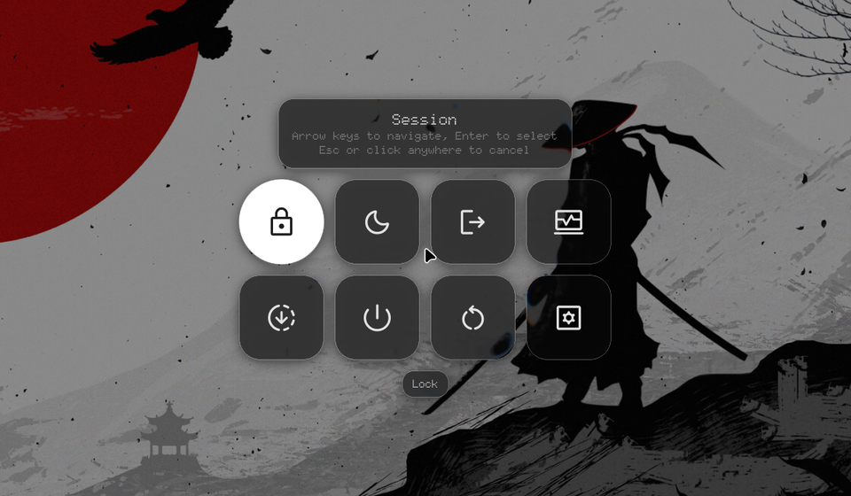
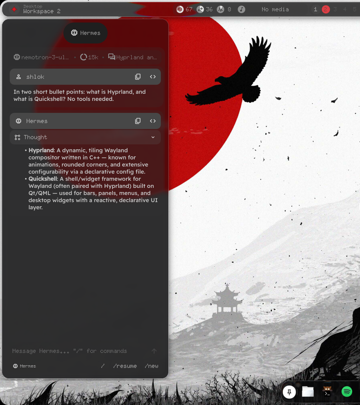
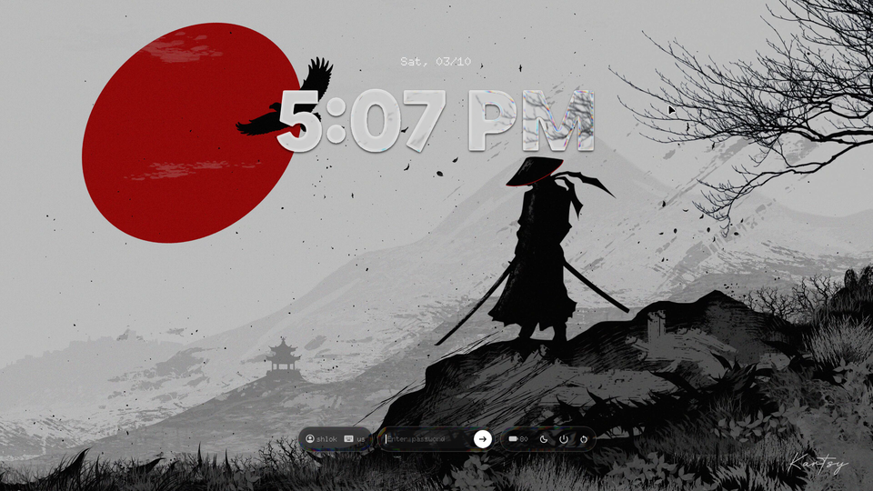

# Nothing Liquid

A Hyprland rice that brings macOS Tahoe's Liquid Glass to Linux: real
refraction on every window and panel, a magic-lamp (genie) minimize, and light
that only appears where you touch the glass, with Nothing OS's dot-matrix type
and one-red accent. Built on
[end-4's illogical-impulse](https://github.com/end-4/dots-hyprland) dotfiles
(Quickshell) for Hyprland 0.56, with a fork of the
[hyprglass](https://github.com/hyprnux/hyprglass) plugin.


| | |
|:---:|:---:|
|  |  |
| Launcher, readable over a bright wallpaper | Overview |
|  |  |
| Settings > Liquid glass | Clear vs Tinted |
|  |  |
| Power menu: glass tiles over a dimmed desktop | Hermes Agent in the sidebar |



Clips: [touch light](docs/media/touch-light.mp4) ·
[magic lamp into the dock](docs/media/genie-dock.mp4) (recorded with an earlier, lighter tuning of the glass)

| Path | What it is |
|---|---|
| `dots/` | submodule: fork of [end-4/dots-hyprland](https://github.com/end-4/dots-hyprland), branch `nothing-liquid` |
| `hyprglass/` | submodule: fork of [hyprnux/hyprglass](https://github.com/hyprnux/hyprglass), branch `nothing-liquid` |
| `install.sh` / `uninstall.sh` | apply to / remove from your live `~/.config`, with backups |
| `sddm/` | the login screen (SDDM theme) and its installer |
| `docs/media/` | screenshots and clips |

## How the glass works

Apple's material is lensing, not blur. Each pane is modelled as a slab whose
rim is a convex squircle bezel, `h(t) = (1 - (1 - t)^4)^(1/4)`. For every pixel
the shader takes the bezel slope there, refracts a ray going straight into the
screen through it with Snell's law (n = 1.5, a little more for blue and a little
less for red, which gives the coloured fringe), and samples the background
where that ray lands. The interior is flat, so it stays sharp; the rim bends
and compresses what is behind it. On top of that:

- a crisp one-pixel rim, the same on every side: there is no key light, so no
  corner of a pane is ever brighter than another. It is a quiet line on its
  own and brightens where the edge reflects something bright behind it
- light scattered inside the curved rim (inner glow)
- the whole pane is a shallow convex lens, not just its rim: what is behind
  it is magnified a little and bends harder toward the edges
- dark mode is smoked: what is behind a pane shows through a little darker
  (Tahoe's dark tint), and a bright backdrop is pulled down toward a ceiling
  so white text stays readable on any wallpaper or window
- light mode is the mirror, milky: a dark backdrop is lifted toward a floor
  so dark text stays readable. The glass follows the shell's light/dark
  switch on its own, live (`default_theme`, handed over with the settings)
- shell panels cast a soft shadow, which keeps them distinct over bright backdrops
- materialize: the lensing ramps in with the pane's alpha instead of a cross-fade

**Light comes only from touch.** Pressing a mouse button on glass (a window, a
bar capsule, the dock, a sidebar module) lets light into it from the press
point: the rims of every pane within reach catch it and the pressed spot
glows. It swells while held, follows the pointer and fades after release.
Clicks on the wallpaper or anything else that is not glass do nothing
(`hyprglass/src/Touch.cpp`).

Shell panels are glass in the shape they actually draw. The plugin blurs each
layer's thresholded alpha into a coverage field and reads the bezel depth and
normal from it, so the bar, dock, sidebars and notification cards each get their
own rim instead of sharing the layer's bounding box.

Windows, bar and dock use the clear `tahoe_clear` glass. Panels that carry
text (launcher and overview, sidebars, notifications, cheatsheet, wallpaper
picker) use `tahoe`, the same glass frostier and darker. Both are in
`hyprglass/src/BuiltInPresets.hpp`.

## Bar panels

Click a chip on the bar and a glass panel drops from it (`bar/BarPopover.qml`,
its own `quickshell:popup` layer so the glass reaches it). Click it again,
anywhere else, or press `Esc` to close it. One is open at a time:

- **resources**: CPU, memory and swap, each with its last few minutes as a
  line, and a button for your system monitor (`apps.taskManager`)
- **media**: what's playing, with cover, seek line and controls, and the
  player to control when several are open. `SUPER+M` opens it too
- **clock**: the time and date, this month's calendar (scroll for others) and
  your to-dos (tick them off here)
- **battery**: level, time left or to full, power draw, health, and the
  power mode (saver, balanced, performance)

On a vertical bar they open beside it.

## Settings

`SUPER+I` > Quick > **Liquid glass**:

- on / off (compositor glass and the shell's see-through surfaces together)
- **Clear / Tinted**, like Tahoe's own switch. Tinted makes every pane more
  opaque and frosted; **Tint** sets how much
- **Edge highlights**: how bright the rims are (0 = none, 100% = as tuned)
- **Refraction**: how strong the lens across each pane is (0 = rim only)
- **Capsule bar**: each bar group its own glass capsule, or (default) one
  glass bar with a single border
- **Modular sidebar**: the right sidebar as separate glass modules, like
  Control Center
- **Accent colour**: the active workspace and the bar's glyph. Nothing red,
  eight other swatches, any hex colour, or None (the theme's own colours)

The shell hands these to the plugin at once (`services/LiquidGlass.qml`) and
saves them to `~/.local/state/quickshell/user/generated/liquidglass.lua`,
which `hypr/hyprland/liquidglass.lua` reads on every start and reload.

## App windows

Every window gets glass; it shows wherever the app draws a see-through
background:

- kitty and foot: `background_opacity 0.40` / `alpha=0.40`
- Qt and KDE apps through the Darkly style (`~/.config/darklyrc`): toolbars,
  menus and tab bars are translucent, and so are Dolphin's file view and
  sidebar
- apps that only draw opaque pixels (Firefox, Electron apps) stay opaque, the
  glass sits behind them unseen. Like Tahoe, where window content is opaque and
  only the chrome is glass.

Floating windows sit on a big soft shadow.

Apps follow the shell's light/dark switch too: Qt and KDE apps through their
colour scheme, GTK apps through GNOME's settings and their `settings.ini`, and
Firefox, Electron and GTK4 apps through the GTK portal. Two things on a system
break that, and `install.sh` warns about both: a masked
`xdg-desktop-portal-gtk` (`systemctl --user unmask xdg-desktop-portal-gtk.service`)
and a session-wide `GTK_THEME` (often in `/etc/environment`), which pins every
GTK app to one theme.

## Magic lamp

The dock icons work like taskbar buttons, through the lamp:

- an app that isn't open opens out of its icon
- clicking the icon of the window in front pours it back into the icon
- a window behind others comes to the front; a minimized one comes back out

`SUPER+H` minimizes the focused window into its icon and `SUPER+SHIFT+H`
brings the last one back. The warp is a Hyprland window transformer
(`hyprglass/src/Genie.cpp`, `genie.frag`); minimized windows wait on
`special:minimized`. Also scriptable:

```
hyprctl hyprglass minimize [address:0x…] [x y w h] [ms]
hyprctl hyprglass restore  [address:0x…] [x y w h] [ms]
hyprctl hyprglass launch <class[,class…]> x y w h [timeout_ms]   # its next window opens out of the rect
hyprctl hyprglass minimized
qs -c ii ipc call genie clickApp <app-id>    # what a click on its dock icon does
qs -c ii ipc call genie minimizeActive | restoreLast | restoreApp <app-id>

hyprctl hyprglass touch X Y [hold_ms]       # light the glass as if pressed there
hyprctl hyprglass touch-probe X Y           # would a press there light anything?
```

## App drawer

The dock's apps button (the grid of dots, at its right end) opens the search
with every installed app under it, A to Z, in place of the workspaces; `SUPER`
still opens search with the workspaces. Type to search as usual; `Down` goes
from the search bar into the apps, the arrow keys move, `Enter` opens. Also
`qs -c ii ipc call search appDrawerToggle`.

## Hermes Agent in the sidebar

With [Hermes Agent](https://github.com/NousResearch/hermes-agent) installed,
the left sidebar's AI page is a chat with your own Hermes: its provider, tools,
memory and skills, nothing configured twice. The shell runs Hermes' own UI
backend, `tui_gateway` (the one its TUI, desktop app and dashboard use), and
speaks its JSON-RPC over stdio (`services/Hermes.qml`). So the sidebar gets
what those get:

- every slash command: `/` lists all of Hermes' commands and your skills,
  with descriptions, and filters as you type (Tab completes, Enter runs, and
  `/us` runs `/usage`). Arguments complete from Hermes (`/personality c…`,
  subcommands); `/resume` and `/model` open pickers (chats can be deleted
  there). What a command prints shows as a card; long output folds
- the agent's questions: its clarify questions with their choices (one or
  several, or your own answer), approvals for risky commands (once, for this
  chat, always, deny), and sudo passwords or keys for skills, typed masked.
  A notification tells you when the sidebar is closed. Commands ask
  according to Hermes' `approvals.mode` (`smart` lets routine ones through),
  one setting for all of Hermes: `hermes config set approvals.mode smart|manual|off`
- replies stream in; reasoning folds into a think block; tool calls,
  subagents and the agent's todo list show inline (click a tool call for the
  command and result). Stop (or `Esc`) ends the turn; what you send while it
  works follows Hermes' `busy` setting (interrupt, queue or steer)
- each chat is a Hermes session (`hermes sessions`), and the last one comes
  back after a restart. Hermes starts the first time the sidebar opens
- `qs -c ii ipc call hermes ask "…"` (a message or a `/command`; also
  `newChat`, `stop`) for keybinds

Without Hermes the page is end-4's own LLM chat.

## Lock and login screens

The glass plugin can't reach a lock surface, so for the lock screen the shell
draws the glass itself: `LiquidGlassEffect` with `shaders/liquidglass.frag`,
the plugin's optics as a Qt shader, shaped by any item's alpha. The lock shows
your wallpaper with the time in glass numerals and the date in dot-matrix
above, and the password, user and power toolbars on glass pills. This is the
shell's own lock screen: if you use hyprlock, turn off Settings > Interface >
Lock screen > "Use Hyprlock (instead of Quickshell)".

Under the clock, on glass cards: what's playing, with its controls, and the
notifications you haven't seen yet (since you last opened the notification
list), one card per app, newest first. An app with several stacks them: tap
the stack to spread it out, the back pill folds it again. They can be cleared
there; opening or answering one waits for the unlock. Settings > Interface >
Lock screen turns either off, or keeps what notifications say off the lock
screen (`lock.showMedia`, `lock.notifications.enable`, `.showContent`).

The login screen (`sddm/`) is the same design as an SDDM theme (Qt 6, SDDM
0.21+): the same glass, your wallpaper and fonts copied in (SDDM can't read
your home folder). On both, the glass under the controls follows the shell's
light/dark switch: the installer hands you `/var/lib/nothing-liquid/login-screen.conf`,
which the switch rewrites and the theme reads as `theme.conf.user`.

Brightness, volume, mute and mic-mute keys work there too, and on text
consoles: no desktop listens for them before you log in, so the installer sets
up a small root service (`sddm/login-keys.py`, `nothing-liquid-login-keys.service`)
that reads them from the keyboards while no graphical session is in front
(inside Hyprland its own binds keep them), and the login screen shows the level
on a glass pill. Both sides step by the same amounts, set in the shell's config
(`light.brightnessStep`, `audio.volumeStep`, in %): the session's keys go
through the shell, which keeps a copy in `/var/lib/nothing-liquid/keys.json` for
the login screen's service.

```
sddm/install.sh --preview    # try it in a window; installs nothing
sddm/install.sh              # install and switch to it (sudo)
sddm/install.sh --uninstall  # back to the theme you had
```

## Shell side (dots fork)

- `appearance.liquidGlass` in the shell config: clear surfaces, no own shadow
  or border (the compositor draws the material), accent colour `#D71921`
- `liquidGlass.capsuleBar` (default off): the bar itself is see-through and
  its groups are glass capsules; off, the bar is one glass piece
- `liquidGlass.modularSidebar` (default on): the right sidebar has no panel
  slab; each card is its own glass, like Control Center
- the current workspace and the bar glyph use the red
- the power menu's tiles are glass over a dimmed desktop (the dim is its own
  window under the menu, `quickshell:sessionScrim`)
- tray menus are glass layers of their own (`quickshell:trayMenu`: the plugin
  can't reach a popup of the bar), and a tray icon your icon theme lacks shows
  as a Material symbol instead of the missing-icon checkerboard
- `services/Genie.qml` + dock icons register as lamp targets
- `hypr/hyprland/liquidglass.lua`: loads the plugin, per-panel presets, keybinds,
  spring motion curves for windows, layers and workspaces

## Install

Needs a working [end-4 dots-hyprland](https://github.com/end-4/dots-hyprland)
install (the `ii` shell, Lua Hyprland config) on **Hyprland 0.56.x**, plus what
it takes to build a Hyprland plugin: `hyprland` headers (`/usr/include/hyprland`),
`make`, `g++` and `pkg-config`.

```
git clone --recurse-submodules https://github.com/shlok-shinde/nothing-liquid
cd nothing-liquid
./install.sh --dry-run   # see exactly what changes
./install.sh             # also updates an earlier install
./uninstall.sh           # put back your files as they were before the first install
```

The installer builds the plugin, copies only the files this fork changes into
`~/.config` and keeps your originals in `~/.local/share/nothing-liquid/original`.
It refuses to overwrite a file you have edited yourself (the fork is based on
end-4 commit `aed4d1ec`; a newer end-4 may look "edited" too): merge by hand, or
`--force` to replace it anyway (it is still backed up).

Reopen Dolphin and other Qt apps after installing; kitty picks the change up
by itself. Rebuild the plugin (`make -C hyprglass`, then `./install.sh`) after
every Hyprland update.

Keeping your own tweaks on a branch of the dots fork? Point the installer at it:
`git -C dots config nothing-liquid.installRef my-branch`.

## Credits

- [end-4/dots-hyprland](https://github.com/end-4/dots-hyprland): the
  illogical-impulse shell this builds on (GPL-3.0)
- [hyprnux/hyprglass](https://github.com/hyprnux/hyprglass): the Liquid Glass
  plugin this extends (BSD 3-Clause)
- Look inspired by Apple's macOS Tahoe Liquid Glass and Nothing OS. Not
  affiliated with, or endorsed by, Apple or Nothing.

## Licence

The scripts in this repository are GPL-3.0 (see `LICENSE`), like end-4's dots.
The submodules keep their own licences: `dots/` GPL-3.0, `hyprglass/` BSD 3-Clause.
