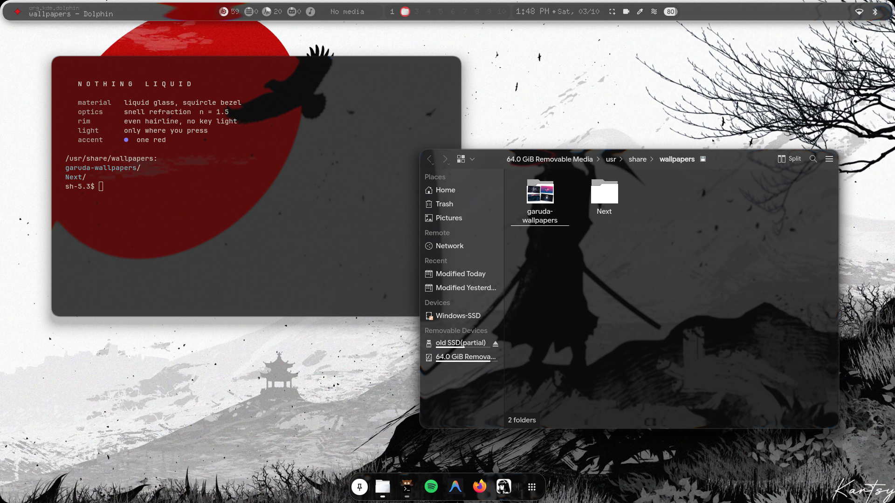
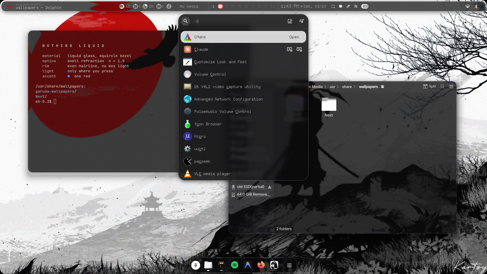
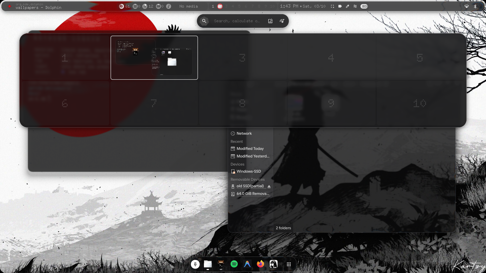
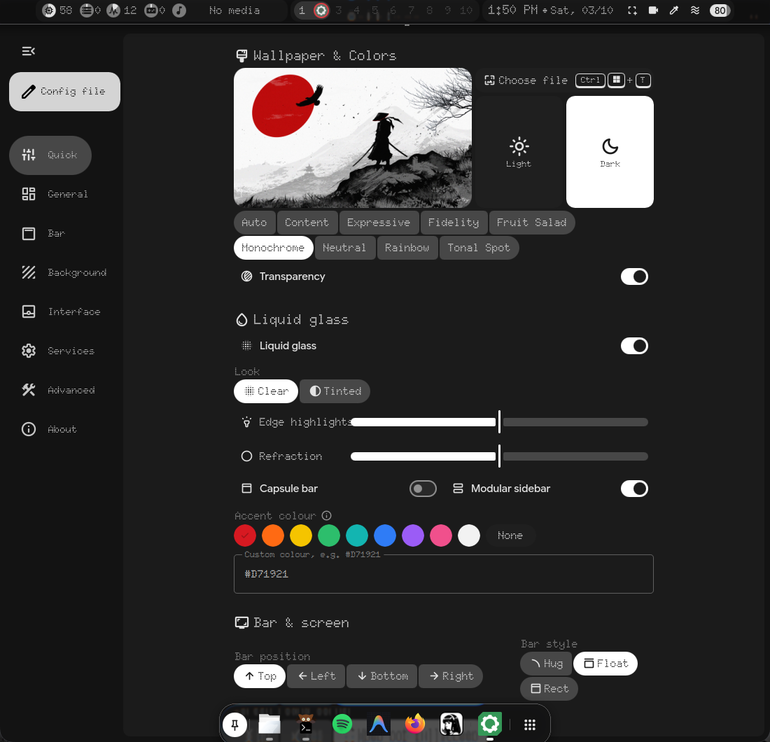
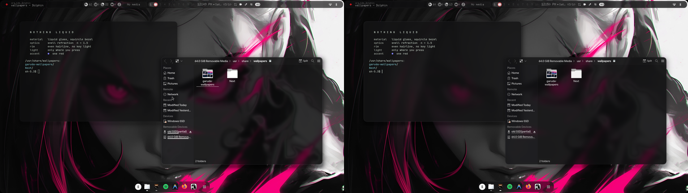

# Nothing Liquid

A Hyprland rice that brings macOS Tahoe's Liquid Glass to Linux: real
refraction on every window and panel, a magic-lamp (genie) minimize, and light
that only appears where you touch the glass, with Nothing OS's dot-matrix type
and one-red accent. Built on
[end-4's illogical-impulse](https://github.com/end-4/dots-hyprland) dotfiles
(Quickshell) for Hyprland 0.56, with a fork of the
[hyprglass](https://github.com/hyprnux/hyprglass) plugin.



| | |
|:---:|:---:|
|  |  |
| Launcher, readable over a bright wallpaper | Overview |
|  |  |
| Settings > Liquid glass | Clear vs Tinted |

Clips: [touch light](docs/media/touch-light.mp4) ·
[magic lamp into the dock](docs/media/genie-dock.mp4) (recorded with an earlier, lighter tuning of the glass)

| Path | What it is |
|---|---|
| `dots/` | submodule: fork of [end-4/dots-hyprland](https://github.com/end-4/dots-hyprland), branch `nothing-liquid` |
| `hyprglass/` | submodule: fork of [hyprnux/hyprglass](https://github.com/hyprnux/hyprglass), branch `nothing-liquid` |
| `install.sh` / `uninstall.sh` | apply to / remove from your live `~/.config`, with backups |
| `docs/media/` | screenshots and clips |

## How the glass works

Apple's material is lensing, not blur. Each pane is modelled as a slab whose
rim is a convex squircle bezel, `h(t) = (1 - (1 - t)^4)^(1/4)`. For every pixel
the shader takes the bezel slope there, refracts a ray going straight into the
screen through it with Snell's law (n = 1.5, a little more for blue and a little
less for red, which gives the coloured fringe), and samples the background
where that ray lands. The interior is flat, so it stays sharp; the rim bends
and compresses what is behind it. On top of that:

- a crisp one-pixel rim, the same on every side: there is no key light, so no
  corner of a pane is ever brighter than another. It is a quiet line on its
  own and brightens where the edge reflects something bright behind it
- light scattered inside the curved rim (inner glow)
- the whole pane is a shallow convex lens, not just its rim: what is behind
  it is magnified a little and bends harder toward the edges
- dark mode is smoked: what is behind a pane shows through a little darker
  (Tahoe's dark tint), and a bright backdrop is pulled down toward a ceiling
  so white text stays readable on any wallpaper or window
- shell panels cast a soft shadow, which keeps them distinct over bright backdrops
- materialize: the lensing ramps in with the pane's alpha instead of a cross-fade

**Light comes only from touch.** Pressing a mouse button on glass (a window, a
bar capsule, the dock, a sidebar module) lets light into it from the press
point: the rims of every pane within reach catch it and the pressed spot
glows. It swells while held, follows the pointer and fades after release.
Clicks on the wallpaper or anything else that is not glass do nothing
(`hyprglass/src/Touch.cpp`).

Shell panels are glass in the shape they actually draw. The plugin blurs each
layer's thresholded alpha into a coverage field and reads the bezel depth and
normal from it, so the bar, dock, sidebars and notification cards each get their
own rim instead of sharing the layer's bounding box.

Windows, bar and dock use the clear `tahoe_clear` glass. Panels that carry
text (launcher and overview, sidebars, notifications, cheatsheet, wallpaper
picker) use `tahoe`, the same glass frostier and darker. Both are in
`hyprglass/src/BuiltInPresets.hpp`.

## Settings

`SUPER+I` > Quick > **Liquid glass**:

- on / off (compositor glass and the shell's see-through surfaces together)
- **Clear / Tinted**, like Tahoe's own switch. Tinted makes every pane more
  opaque and frosted; **Tint** sets how much
- **Edge highlights**: how bright the rims are (0 = none, 100% = as tuned)
- **Refraction**: how strong the lens across each pane is (0 = rim only)
- **Capsule bar**: each bar group its own glass capsule, or (default) one
  glass bar with a single border
- **Modular sidebar**: the right sidebar as separate glass modules, like
  Control Center
- **Accent colour**: the active workspace and the bar's glyph. Nothing red,
  eight other swatches, any hex colour, or None (the theme's own colours)

The shell hands these to the plugin at once (`services/LiquidGlass.qml`) and
saves them to `~/.local/state/quickshell/user/generated/liquidglass.lua`,
which `hypr/hyprland/liquidglass.lua` reads on every start and reload.

## App windows

Every window gets glass; it shows wherever the app draws a see-through
background:

- kitty and foot: `background_opacity 0.40` / `alpha=0.40`
- Qt and KDE apps through the Darkly style (`~/.config/darklyrc`): toolbars,
  menus and tab bars are translucent, and so are Dolphin's file view and
  sidebar
- apps that only draw opaque pixels (Firefox, Electron apps) stay opaque, the
  glass sits behind them unseen. Like Tahoe, where window content is opaque and
  only the chrome is glass.

Floating windows sit on a big soft shadow.

## Magic lamp

`SUPER+H` pours the focused window into its own dock icon; clicking the icon
(or `SUPER+SHIFT+H`) brings it back out. The warp is a Hyprland window
transformer (`hyprglass/src/Genie.cpp`, `genie.frag`); minimized windows wait on
`special:minimized`. Also scriptable:

```
hyprctl hyprglass minimize [address:0x…] [x y w h] [ms]
hyprctl hyprglass restore  [address:0x…] [x y w h] [ms]
hyprctl hyprglass minimized
qs -c ii ipc call genie minimizeActive | restoreLast | restoreApp <app-id>

hyprctl hyprglass touch X Y [hold_ms]       # light the glass as if pressed there
hyprctl hyprglass touch-probe X Y           # would a press there light anything?
```

## Shell side (dots fork)

- `appearance.liquidGlass` in the shell config: clear surfaces, no own shadow
  or border (the compositor draws the material), accent colour `#D71921`
- `liquidGlass.capsuleBar` (default off): the bar itself is see-through and
  its groups are glass capsules; off, the bar is one glass piece
- `liquidGlass.modularSidebar` (default on): the right sidebar has no panel
  slab; each card is its own glass, like Control Center
- the current workspace and the bar glyph use the red
- `services/Genie.qml` + dock icons register as lamp targets
- `hypr/hyprland/liquidglass.lua`: loads the plugin, per-panel presets, keybinds,
  spring motion curves for windows, layers and workspaces

## Install

Needs a working [end-4 dots-hyprland](https://github.com/end-4/dots-hyprland)
install (the `ii` shell, Lua Hyprland config) on **Hyprland 0.56.x**, plus what
it takes to build a Hyprland plugin: `hyprland` headers (`/usr/include/hyprland`),
`make`, `g++` and `pkg-config`.

```
git clone --recurse-submodules https://github.com/shlok-shinde/nothing-liquid
cd nothing-liquid
./install.sh --dry-run   # see exactly what changes
./install.sh             # also updates an earlier install
./uninstall.sh           # put back your files as they were before the first install
```

The installer builds the plugin, copies only the files this fork changes into
`~/.config` and keeps your originals in `~/.local/share/nothing-liquid/original`.
It refuses to overwrite a file you have edited yourself (the fork is based on
end-4 commit `aed4d1ec`; a newer end-4 may look "edited" too): merge by hand, or
`--force` to replace it anyway (it is still backed up).

Reopen Dolphin and other Qt apps after installing; kitty picks the change up
by itself. Rebuild the plugin (`make -C hyprglass`, then `./install.sh`) after
every Hyprland update.

Keeping your own tweaks on a branch of the dots fork? Point the installer at it:
`git -C dots config nothing-liquid.installRef my-branch`.

## Credits

- [end-4/dots-hyprland](https://github.com/end-4/dots-hyprland): the
  illogical-impulse shell this builds on (GPL-3.0)
- [hyprnux/hyprglass](https://github.com/hyprnux/hyprglass): the Liquid Glass
  plugin this extends (BSD 3-Clause)
- Look inspired by Apple's macOS Tahoe Liquid Glass and Nothing OS. Not
  affiliated with, or endorsed by, Apple or Nothing.

## Licence

The scripts in this repository are GPL-3.0 (see `LICENSE`), like end-4's dots.
The submodules keep their own licences: `dots/` GPL-3.0, `hyprglass/` BSD 3-Clause.
